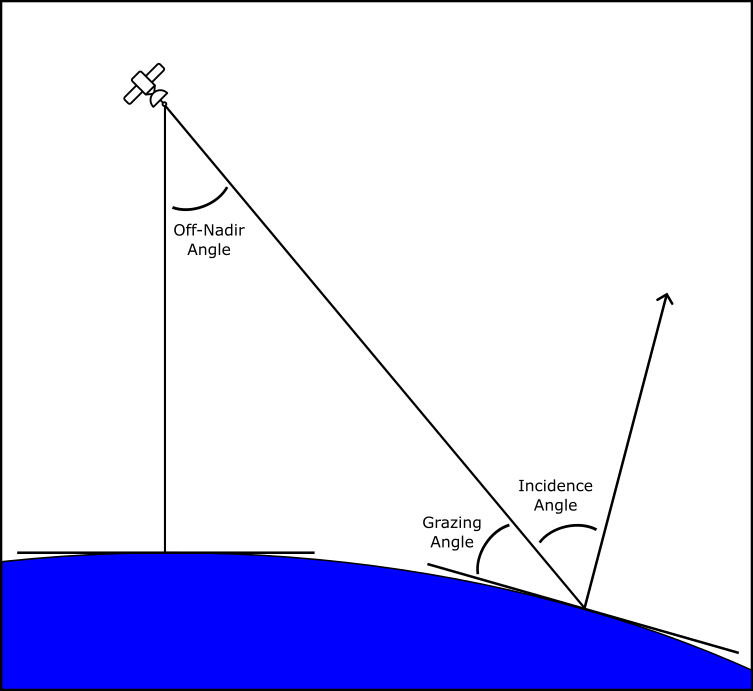
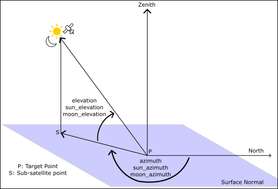

# View Geometry Extension Specification

- **Title:** View Geometry
- **Identifier:** <https://stac-extensions.github.io/view/v1.1.0/schema.json>
- **Field Name Prefix:** view
- **Scope:** Item, Collection
- **Extension [Maturity Classification](https://github.com/radiantearth/stac-spec/tree/master/extensions.md#extension-maturity):** Stable
- **Owner**: @matthewhanson
- **History:** [Prior to March 30, 2021](https://github.com/radiantearth/stac-spec/commits/v1.0.0-rc.2/extensions/view)

This document explains the View Geometry Extension to the
[SpatioTemporal Asset Catalog](https://github.com/radiantearth/stac-spec) (STAC) specification.

View Geometry adds metadata related to
angles of sensors and other radiance angles that affect the view of resulting data. It will often be combined with other
extensions that describe the actual data, such as the `eo`, `sat` or `sar` extensions.

- [Example](examples/item.json)
- [JSON Schema](json-schema/schema.json)
- [Changelog](./CHANGELOG.md)

## Fields

The fields in the table below can be used in these parts of STAC documents:

- [ ] Catalogs
- [ ] Collections
- [x] Item Properties (incl. Summaries in Collections)
- [x] Assets (for both Collections and Items, incl. Item Asset Definitions in Collections)
- [ ] Links

| Field Name           | Type   | Description |
| -------------------- | ------ | ----------- |
| view:off_nadir       | number | The angle from the sensor between nadir (straight down) and the scene center. Measured in degrees (0-90). |
| view:incidence_angle | number | The incidence angle is the angle between the vertical (normal) to the intercepting surface and the line of sight back to the satellite at the scene center. Measured in degrees (0-90). |
| view:azimuth         | number | Viewing azimuth angle. The angle measured from the sub-satellite point (point on the ground below the platform) between the scene center and true north. Measured clockwise from north in degrees (0-360). |
| view:sun_azimuth     | number | Sun azimuth angle. From the scene center point on the ground, this is the angle between truth north and the sun. Measured clockwise in degrees (0-360). |
| view:sun_elevation   | number | Sun elevation angle. The angle from the tangent of the scene center point to the sun. Measured from the horizon in degrees (`-90`-`90`). Negative values indicate the sun is below the horizon, e.g. sun elevation of -10° means the data was captured during [nautical twilight](https://www.timeanddate.com/astronomy/different-types-twilight.html). |
| view:moon_azimuth    | number | Moon azimuth angle. From the scene center point on the ground, this is the angle between truth north and the moon. Measured clockwise in degrees (0-360). |
| view:moon_elevation  | number | Moon elevation angle. The angle from the tangent of the scene center point to the moon. Measured from the horizon in degrees (`0`-`90`). |

The angles `off_nadir` and `incidence_angle` are angles measured on a 2d plane formed by the sensor location,
the sub-satellite point on the earth, and the center of the target area as shown in the diagram below.  Grazing
angle is shown as it is frequently used but it is not included in this extension because it is simply the
complement of the incidence angle. When the off-nadir angle is low (low incidence angle) then the two angles are
approximately equal. However, at high off-nadir angles with high altitude sensors the curvature of the earth
has an impact and the two angles are no longer equivalent.



The `azimuth` (`sun_azimuth`, `moon_azimuth`), and the `elevation` (`sun_elevation`, `moon_elevation`) angles are measured
as per the diagram below. Azimuth angles are measured as degrees from North, and elevation angles are measured up from
the target plane to the body (satellite, sun, or moon).



## Asset Roles

One of the best practices is to use [Asset Roles](https://github.com/radiantearth/stac-spec/tree/master/item-spec/item-spec.md#asset-roles)
to provide clients with more information about the assets in an item. The following list includes a shared vocabulary for some common EO assets.
This list should not be considered definitive, and implementors are welcome to use other asset roles. If consensus and tooling consolidates around
these role names then they will be specified in the future as more standard than just 'best practices'. The roles listed below
all tend to be additional files that contain specific values for every single pixel. It is recommended to use them all with the role of 'metadata'.

| Role Name            | Description |
| -------------------- | ----------- |
| incidence-angle      | Points to a file with per-pixel incidence angles. |
| azimuth              | Points to a file with per-pixel azimuth angles. |
| sun-azimuth          | Points to a file with per-pixel sun azimuth angles. |
| sun-elevation        | Points to a file with per-pixel sun elevation angles. |
| moon-azimuth         | Points to a file with per-pixel moon azimuth angles. |
| moon-elevation       | Points to a file with per-pixel moon elevation angles. |
| terrain-shadow       | Points to a file that indicates whether a pixel is not directly illuminated due to terrain shadowing. |
| terrain-occlusion    | Points to a file that indicates whether a pixel is not visible to the sensor due to terrain occlusion during off-nadir viewing. |
| terrain-illumination | Points to a file with coefficients used for terrain illumination correction are provided for each pixel. |

## Contributing

All contributions are subject to the
[STAC Specification Code of Conduct](https://github.com/radiantearth/stac-spec/blob/master/CODE_OF_CONDUCT.md).
For contributions, please follow the
[STAC specification contributing guide](https://github.com/radiantearth/stac-spec/blob/master/CONTRIBUTING.md) Instructions
for running tests are copied here for convenience.

### Running tests

The same checks that run as checks on PR's are part of the repository and can be run locally to verify that changes are valid.
To run tests locally, you'll need `npm`, which is a standard part of any [node.js installation](https://nodejs.org/en/download/).

First you'll need to install everything with npm once. Just navigate to the root of this repository and on
your command line run:

```bash
npm install
```

Then to check markdown formatting and test the examples against the JSON schema, you can run:

```bash
npm test
```

This will spit out the same texts that you see online, and you can then go and fix your markdown or examples.

If the tests reveal formatting problems with the examples, you can fix them with:

```bash
npm run format-examples
```
